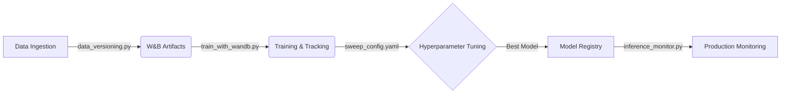

# MLOps Pipeline: Theory & Implementation Guide

This document provides a detailed explanation of the MLOps pipeline implemented for the Semi-Supervised Grocery Classification project. It is designed to explain the theoretical concepts and the specific code implementation to help understand *why* and *how* MLOps is used.

## 1. MLOps Theory: Why do we need it?

**Machine Learning Operations (MLOps)** is the practice of combining Machine Learning, DevOps, and Data Engineering to deploy and maintain ML systems in production reliably and efficiently.

Unlike traditional software, ML systems have three changing components:
1.  **Code**: The algorithms and logic (like standard software).
2.  **Data**: The input data used for training (which changes over time).
3.  **Models**: The artifacts produced by training code on data.

### Key MLOps Concepts Implemented:

*   **Reproducibility**: Being able to recreate a specific model by knowing exactly which code version, data version, and hyperparameters were used.
*   **Experiment Tracking**: Automatically logging every training run's metrics (accuracy, loss) to compare different approaches objectively.
*   **Model Registry**: A central version control system for *models* (binary files), not just code. It defines which model is "Staging", "Production", etc.
*   **Data Lineage**: Tracking the origin and evolution of your datasets.
*   **Monitoring**: Watching the model in production to detect "drift" (when the real world data starts looking different from training data).

---

## 2. The Pipeline Overview

Our pipeline uses **Weights & Biases (W&B)** as the central platform.



---

## 3. detailed Code Explanation

### A. Data Versioning (`src/data_versioning.py`)

**The Goal**: Never say "I trained this on the dataset available on Monday". Instead, say "I trained this on `grocery-dataset:v1`".

**Key Code Explanation**:
This script treats data as an **Artifact**. An artifact is a folder of files that W&B tracks.

```python
# key snippet from data_versioning.py
artifact = wandb.Artifact(
    name=artifact_name,  # e.g., "grocery-dataset"
    type="dataset",
    description=description,
    metadata={
        "total_samples": total_samples,
        "classes": classes
    }
)
artifact.add_dir(data_dir) # Adds all files in directory to the artifact
run.log_artifact(artifact) # Uploads/Versions the artifact
```
*   **`metadata`**: We store extra info (distribution, counts) directly in the artifact object so we can query it later without downloading the whole dataset.
*   **`add_dir`**: Intelligently hashes files. If v2 only changes 1 image, W&B only uploads that 1 image, saving massive space (Deduplication).

### B. Experiment Tracking (`src/train_with_wandb.py`)

**The Goal**: Log every single metric, hyperparameter, and output confusion matrix to a dashboard to find the best model.

**Key Code Explanation**:

```python
# Initialization
wandb.init(
    project="grocery-classification",
    config={  # Hyperparameters to track
        "labeled_ratio": labeled_ratio,
        "algorithm": "label_propagation",
        "n_neighbors": n_neighbors
    }
)

# ... Training Loop ...

# Logging Metrics
wandb.log({
    "epoch": epoch,
    "train_loss": loss,
    "test_accuracy": accuracy,
    "f1_score": f1
})
```
*   **`wandb.init`**: Starts a "Run". The `config` dictionary is crucial—it saves your inputs so you can correlation inputs to outputs later.
*   **`wandb.log`**: Streams data to the server. We use this for accuracies, but also for complex media like Confusion Matrices and images.

### C. Hyperparameter Sweeps (`sweep_config.yaml`)

**The Goal**: Instead of manually guessing "maybe learning rate 0.001 is better?", we use an automated agent to search the space.

**Config Explanation**:
The YAML file defines the "Search Space" and the "Search Strategy".

```yaml
method: bayes  # Bayesian Optimization (Smart search)
metric:
  name: test_accuracy
  goal: maximize
parameters:
  n_neighbors:
    distribution: int_uniform
    min: 5
    max: 20
```
*   **`method: bayes`**: This is the "Brain". It builds a probabilistic model of `(hyperparams) -> (accuracy)`. It predicts which parameters are likely to give high accuracy and tries those next. It's much faster than Grid Search.
*   **`early_terminate`**: If a run is performing poorly at epoch 2, kill it. Don't waste GPU time.

### D. Model Registry (`src/model_registry.py`)

**The Goal**: Manage the lifecycle of the binary model files (`.pkl`, `.pth`).

**Key Code Explanation**:

```python
# Registering a model
run.link_artifact(
    model_artifact,
    target_path="model-registry/grocery-classifier"
)

# "Promoting" a model (Adding an alias)
artifact.aliases.append("production")
artifact.save()
```
*   **Registry**: Acts like a catalog. You can see `v1`, `v2`, `v3` of your model.
*   **Aliases**: Tags like `staging` or `production`. Your inference code should never hardcode `v3`. It should load `production`, so you can swap models without changing code.

### E. Production Monitoring (`src/inference_monitor.py`)

**The Goal**: Detect if the model is failing in the real world.

**Key Code Explanation**:
We calculate **Drift**. Drift means the distribution of incoming data ($P(X)_{real}$) is different from training data ($P(X)_{train}$).

```python
# Logging inference data
wandb.log({
    "inputs": wandb.Image(image),
    "prediction": prediction,
    "confidence": confidence_score
})
```
We monitor:
1.  **Confidence Distribution**: If the model starts being "unsure" (low confidence) about everything, the data might be weird.
2.  **Class Distribution**: If we suddenly predict "Apple" 90% of the time (when it used to be 10%), something is wrong.

---

## 4. How to Use The Pipeline

### Step 1: Track a Training Run
Ideally, running the training script will automatically log to the dashboard.
```bash
python src/train_with_wandb.py --labeled-ratio 0.2 --algorithm label_propagation
```
*Go to the W&B link printed in the terminal to see live graphs.*

### Step 2: Run a Sweep (Auto-Optimization)
1.  **Initialize the Sweep Controller**:
    ```bash
    wandb sweep sweep_config.yaml
    ```
    *This returns a Sweep ID (e.g., `z1y2x3w4`).*

2.  **Start an Agent** (The worker that actually trains):
    ```bash
    wandb agent <YOUR_SWEEP_ID> --count 5
    ```
    *It will run 5 experiments, choosing parameters intelligently.*

### Step 3: Register the Best Model
Once you find the best run in the dashboard, you can register it using the API or the UI.
```bash
python src/model_registry.py register-all --models-dir models/
```

### Step 4: Simulate Production
Run the monitor on a "test" folder to simulate new data coming in.
```bash
python src/inference_monitor.py --model-path models/best_model.pkl
```

---
**Summary for the Professor**:
This system transforms the project from a simple "script" into a "production-ready pipeline". It ensures that every result is reproducible, the best model is found scientifically (not by guessing), and the deployment is versioned and monitored.
